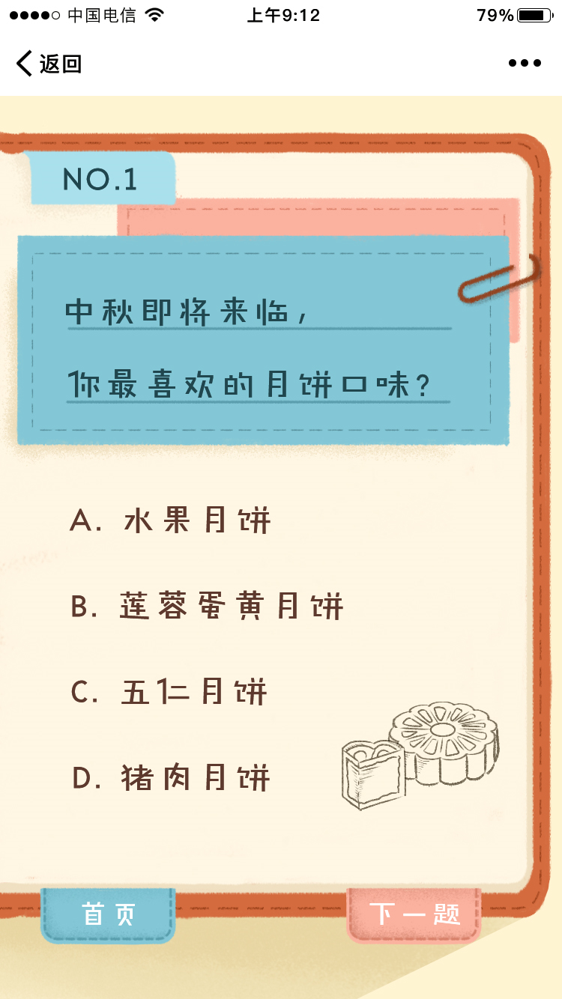
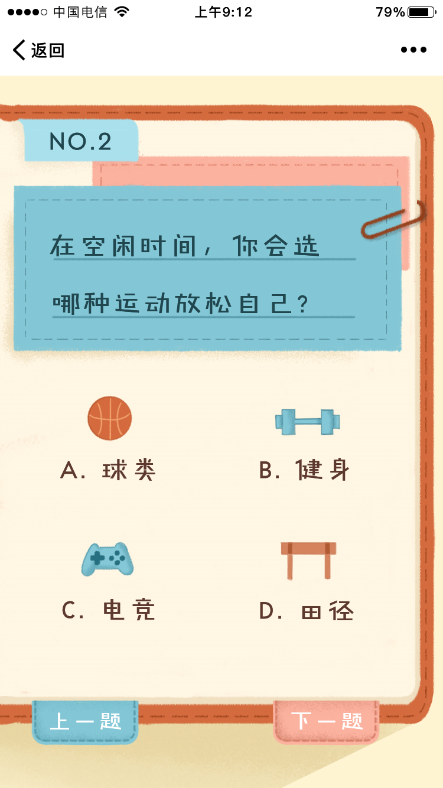
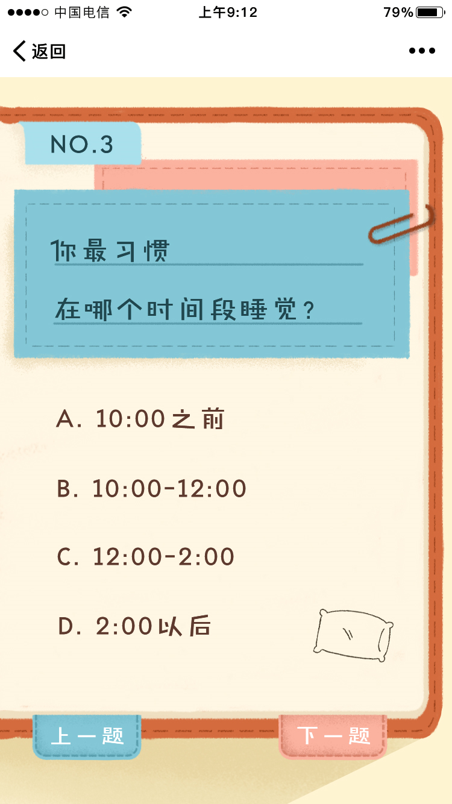
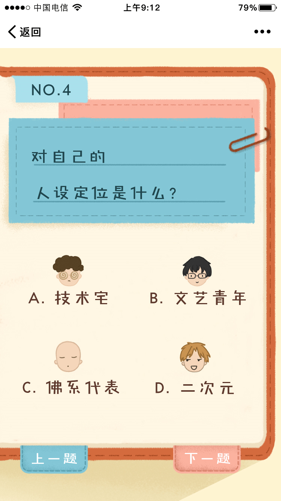
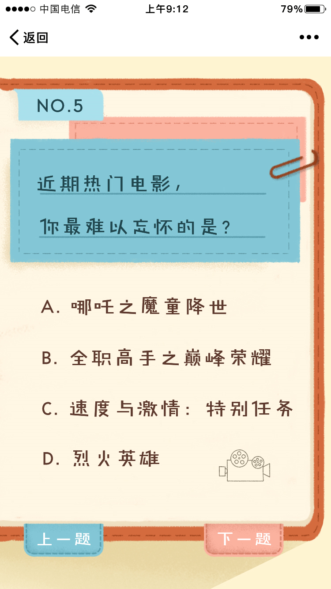
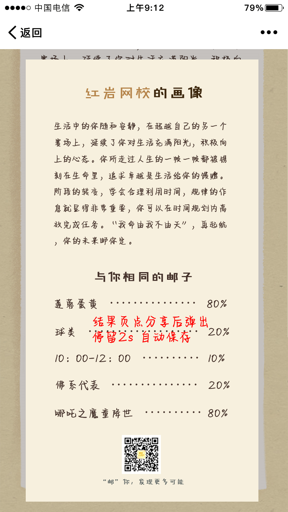
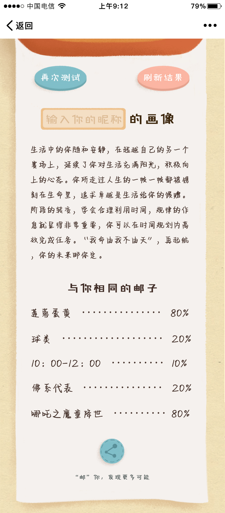

##### 整体结构 (仅展示 src 目录结构)

├─src
| ├─App.vue  
| ├─main.js
| ├─views
| | ├─Home.vue // 项目首页
| | ├─Loading.vue // 项目结果页
| | └Question.vue // 答题页
| ├─store //数据管理
| | ├─index.js
| | ├─question.js
| | ├─type
| | | ├─actions.js
| | | └mutations.js
| ├─router // 路由管理
| | └index.js
| ├─images
| |  
| ├─components //项目组件
| | ├─AnswerBox.vue
| | ├─AnswerDecoration.vue
| | ├─QuestionAction.vue
| | └QuestionBox.vue
| ├─common //封装项目接口
| | ├─service
| | | ├─api.js //后台请求接口
| | | └jwt.js //登录验证,得到用户 token
| |
| ├─assets //静态文件
| | ├─stylus
| | | ├─gloabal.css
| | | └reset.css
| | ├─images
| | |  
| | ├─font
| | |

##### 技术栈

- vue
- vue-router
- vuex
- styled-px2vw // px to vw

##### 项目运行方式

使用 vue-cli 3.0 创建 按照标准运行即可

##### 特别的地方

运用 [html2cnvas](https://html2canvas.hertzen.com/) 完成截屏功能

##### 图例

